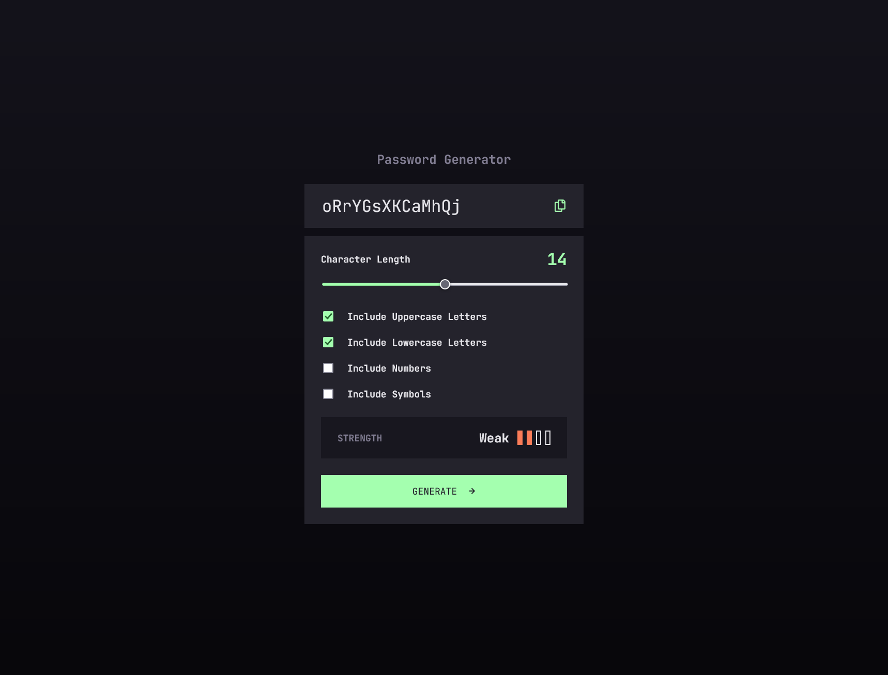

# Password Generator

## Overview

### The challenge

Users should be able to:

- Generate a password based on the selected inclusion options
- Copy the generated password to the computer's clipboard
- See a strength rating for their generated password
- View the optimal layout for the interface depending on their device's screen size
- See hover and focus states for all interactive elements on the page

### Screenshot

### Links

- Solution URL: [https://www.frontendmentor.io/solutions/password-generator-using-vue-SkhbS4A9k8](https://www.frontendmentor.io/solutions/password-generator-using-vue-SkhbS4A9k8)
- Live Site URL: [https://fementor-password-generator.vercel.app/](https://fementor-password-generator.vercel.app/)

## My process

### Built with

- Semantic HTML5 markup
- CSS custom properties
- Flexbox
- [Vue](https://vuejs.org/)
- [Vite](https://vitejs.dev/)
- [SCSS](https://sass-lang.com/)
